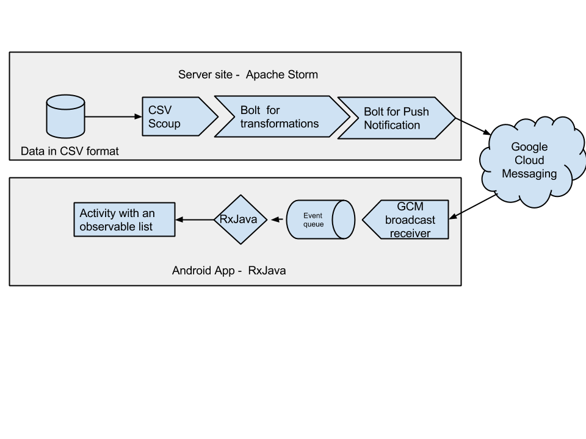

Prototype for a reactive API
============================

## Description

This is a prototype of a reactive API for mobile apps.
The objective of this project is just to try out the viability of using an Even Drive API instead of a Rest API in a mobile app.
As a first step of this aim, I´ve used Apache Storm to process a stream of events and feed a mobile app in realtime using silent push notifications.

Lib used:

* Apache Storm as an even drive processor in the server side
* RxJava for Android as a reactive library to process the incoming events from the server.

## Motivation

You can find quite a few successful web apps and frameworks following the principles of the Reactive manifesto,
 but I didn't find any easy way to implement the same principles for a mobile app.

Of course there are easier ways to send notifications to mobile apps,
 but I wanted to test a different approach as a proof of concept of something similar to a scalable event drive API.

## Description

The modules in the architecture are follows:

* Server side: It's a simple Apache Storm app with a few bold to transform a CSV file and send messages through the Google Cloud Messaging.  

* Reactive Android app: Using RxJava to process the incoming message form Google Cloud Messaging.  

So far I've just implemented the communication  server to client, but it's possible to use a similar approach to send message from RxJava events to Apache Storm.

## Acknowledgment

This projects has been developed as a part of a Hackday for Daft.ie